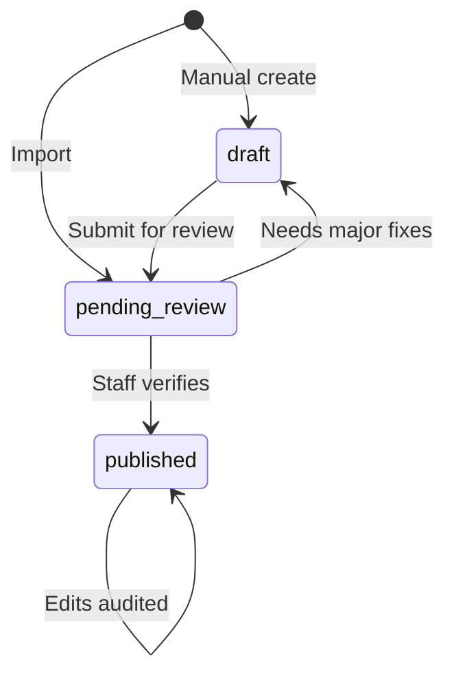

# Admin Workflow

Staff curation for Main Event Archive. Admin UI default: **Filament** (separate from public Inertia + React app).

## Roles

- `users.is_admin = true` → access Filament panel
- All curation is staff-only in v1 (no public submissions)

## Show lifecycle

## Import review (v1)

1. Run `vendor/bin/sail artisan shows:import wikidata {scope}`
2. Review imported shows in Filament queue (`status = pending_review`)
3. Verify card order, participants, results (results stored but spoiler-gated on public site)
4. Set soft spoiler flags where known
5. Link Cagematch URLs: run `vendor/bin/sail artisan shows:link-cagematch --promotion=wcw --from=1993 --to=1996 --dry-run`. If live fetch is blocked (HTTP 403), save each listing page from your browser as HTML and pass `--html=file.html` or `--html-dir=storage/app/cagematch/wcw-ppv/`. Paste URLs manually in Filament when no match is found.
6. Publish individual shows, or use **Publish all** on the Shows list to publish every `pending_review` row at once (browse cache is invalidated once).

## Manual show creation

1. Create promotion/show metadata
2. Add matches in card order with participants
3. Enter results (for spoiler-on view later)
4. Flag surprises
5. Publish

## v1.1 additions

- Match timestamp fields for Clash (and tooling for future TV)
- Admin UI note: "Stored, not yet playable" until v1.6

## v1.6 additions

- Link YouTube URL at show level
- Review AI timestamp/spoiler suggestions
- Verify embeddability

## v1.7 additions

- Per-match YouTube URLs where full show unavailable

## Spoiler admin checklist

When curating, consider flagging:

- [ ] Royal Rumble / Battle Royal unannounced entrants
- [ ] Money in the Bank winner not on pre-show card
- [ ] Tournament bracket rounds — set `tournament_round` (1 = opening bouts visible with spoilers off; 2+ = masked)
- [ ] Tournament final or advancement not advertised
- [ ] Surprise return or debut
- [ ] Match added night-of not on announced card

## Audit trail (recommended)

Track `verified_by`, `verified_at` on publish. Consider `activity log` for edits post-v1.

## What staff never imports from Cagematch

- Ratings
- Bulk card data via scraping

## Related docs

- [Data import](data-import.md)
- [Spoiler rules](spoiler-rules.md)
- [AI enrichment](ai-enrichment.md)
