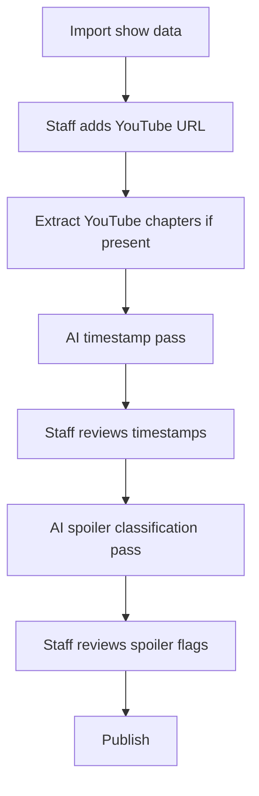

# AI Enrichment (v1.6+)

Outline for YouTube linking and AI-assisted enrichment. **Not in v1–v1.5 scope.**

## Milestone

v1.6 delivers staff YouTube linking + optional AI suggestions for URLs and match timestamps. Spoiler classification assist may run in the same enrichment pass.

## Pipeline



## Timestamp strategies (layered)

1. **YouTube chapters** — deterministic, try first
2. **Caption/transcript alignment** — match participant names to caption timings
3. **LLM on transcript + card** — suggest boundaries; highest hallucination risk

Store suggestions as `suggested_timestamp_start/end` or `enrichment_status = pending_review`. Staff accept / tweak / reject.

## Spoiler classification assist

| Flag | Feasibility |
|------|-------------|
| `is_surprise` | Moderate if announced vs actual card exists |
| `is_surprise_entrant` | Moderate for Rumble/BR patterns |
| Tournament | Lower — manual longer |

Rules engine ("match in results but not announced card") may outperform pure LLM when data supports it.

## Guardrails

- AI output **never auto-published**
- Provenance: `enriched_by`, `enrichment_model`, `enriched_at`, `approved_by`
- Prefer no suggestion over wrong timestamp
- YouTube ToS: captions/chapters API only — no video download
- Cost controls: batch, per-show opt-in, rate limits

## Architecture

```php
interface ShowEnricher
{
    public function enrich(Show $show, EnrichmentPass $pass): EnrichmentResult;
}

enum EnrichmentPass
{
    case Timestamps;
    case SpoilerClassification;
}

// vendor/bin/sail artisan shows:enrich {show} --pass=timestamps
```

## Related docs

- [ADR 003](../architecture/decisions/003-ai-enrichment-stretch.md)
- [Video providers](../architecture/video-providers.md)
- [Admin workflow](admin-workflow.md)
