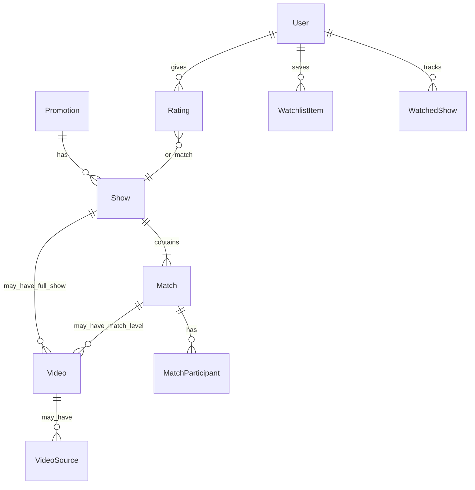

# Data Model

Single source of truth for Main Event Archive entities, relationships, and key fields. Schema is designed in v1 to support v1.6 video and v1.7+ per-match video without migration.

## Entity relationship overview

## Promotion

| Field | Type | Notes |
|-------|------|-------|
| id | bigint | PK |
| name | string | e.g. "World Championship Wrestling" |
| slug | string | unique, URL-safe |
| timestamps | | |

## Show

| Field | Type | Notes |
|-------|------|-------|
| id | bigint | PK |
| promotion_id | FK | |
| title | string | e.g. "Starrcade 1997" |
| slug | string | unique per promotion or global |
| date | date | date only, no time |
| episode_number | int nullable | TV series episode # (e.g. global Nitro # from series premiere) |
| venue | string | nullable |
| city | string | nullable |
| venue_id | FK nullable | linked `venues` row; single-venue shows only (see [wikipedia-venue-parser.md](wikipedia-venue-parser.md)) |
| show_type | enum | ppv, tv, special, house_show |
| brand | enum nullable | raw, smackdown — unused until WWE v1.3 |
| attendance | int nullable | |
| tv_rating | decimal nullable | Nielsen/TNT household rating when known (TV shows) |
| status | enum | draft, pending_review, published |
| cagematch_url | string nullable | link-out only |
| source | string nullable | wikidata, wikipedia, manual |
| source_id | string nullable | QID or page title |
| source_url | string nullable | |
| imported_at | timestamp nullable | |
| verified_at | timestamp nullable | |
| verified_by | FK users nullable | |
| timestamps | | |

**Indexes:** promotion_id + date, status, full-text on title

## Venue

Structured arena/venue records populated from Wikipedia during show ingest. Public detail page at `GET /venues/{slug}` lists venue metadata, historical aliases, Wikipedia attribution, and published shows linked via `shows.venue_id`.

| Field | Type | Notes |
|-------|------|-------|
| id | bigint | PK |
| name | string | current display name |
| slug | string | unique, URL-safe |
| city | string nullable | display text |
| state_province | string nullable | display text |
| country | string nullable | display text |
| capacity | int nullable | current capacity only |
| wikipedia_page_title | string | unique — canonical title after redirect |
| wikipedia_url | string | attribution link-out |
| imported_at | timestamp nullable | |
| timestamps | | |

**Relationships:** `hasMany` Show, `hasMany` VenueAlias

## VenueAlias

Historical or alternate names for a venue (former arena names, piped wikilink labels, Wikipedia redirect sources).

| Field | Type | Notes |
|-------|------|-------|
| id | bigint | PK |
| venue_id | FK | |
| name | string | |
| source | string | `wikipedia_infobox`, `wikipedia_redirect`, `show_infobox` |
| timestamps | | |

**Unique:** venue_id + name

## Match

| Field | Type | Notes |
|-------|------|-------|
| id | bigint | PK |
| show_id | FK | |
| card_order | int | 1-based position |
| match_type | string | singles, tag, triple_threat, battle_royal, segment, etc. |
| title_name | string nullable | e.g. "WCW World Heavyweight" |
| is_surprise | boolean | soft spoiler — omit from card when false spoilers |
| is_rateable | boolean | false for segments in v1 |
| winner_side | int nullable | **hard spoiler** — or use match_results table |
| finish | string nullable | pinfall, submission, dq, etc. **hard spoiler** |
| duration_seconds | int nullable | **hard spoiler** |
| timestamp_start | int nullable | seconds into show video **hard spoiler** |
| timestamp_end | int nullable | **hard spoiler** |
| title_changed | boolean | **hard spoiler** |
| timestamps | | |

## MatchParticipant

| Field | Type | Notes |
|-------|------|-------|
| id | bigint | PK |
| match_id | FK | |
| name | string | display name v1 |
| side | int | 1, 2, or group id for multi-side |
| is_surprise_entrant | boolean | soft spoiler |
| placeholder_label | string nullable | e.g. "Mystery opponent" |
| sort_order | int | order within side |

## Video

Attach to **show** (full broadcast) OR **match** (individual upload). Exactly one of `show_id` or `match_id` must be set.

| Field | Type | Notes |
|-------|------|-------|
| id | bigint | PK |
| show_id | FK nullable | full-show video |
| match_id | FK nullable | per-match video (v1.7+) |
| provider | string | youtube, vimeo, ... |
| external_id | string | e.g. YouTube video ID |
| url | string | canonical URL |
| title | string nullable | from provider |
| duration_seconds | int nullable | |
| embeddable | boolean | |
| embed_disabled_reason | string nullable | |
| last_verified_at | timestamp nullable | |
| is_primary | boolean | when multiple sources |
| timestamps | | |

**Constraint:** `(show_id IS NOT NULL) XOR (match_id IS NOT NULL)` or check constraint equivalent.

## VideoSource (optional v1.6+)

Alternate URLs for same video (mirrors, quality variants).

| Field | Type | Notes |
|-------|------|-------|
| id | bigint | PK |
| video_id | FK | |
| url | string | |
| status | enum | active, unavailable, embed_disabled |
| rank | int | staff preference order |

## Rating

| Field | Type | Notes |
|-------|------|-------|
| id | bigint | PK |
| user_id | FK | |
| rateable_type | morph | Show or Match |
| rateable_id | bigint | |
| stars | tinyint | 1–5 |
| timestamps | | |

**Unique:** user_id + rateable_type + rateable_id

## WatchlistItem

| Field | Type | Notes |
|-------|------|-------|
| user_id | FK | |
| show_id | FK | |
| timestamps | | |

## WatchedShow

| Field | Type | Notes |
|-------|------|-------|
| user_id | FK | |
| show_id | FK | |
| watched_at | timestamp | |

## User (extensions)

| Field | Type | Notes |
|-------|------|-------|
| is_admin | boolean | staff access |
| spoilers_enabled_default | boolean | global default preference |

## Playback resolution (v1.7+)

| Show video | Match video | Behavior |
|------------|-------------|----------|
| Yes | No | Embed show; jump via timestamp when spoilers on |
| Yes | Yes | Prefer match video if set; else timestamp into show |
| No | Yes | Embed per-match on card |
| No | No | No video / link-out only |

## Deferred entities

- **Wrestler** — v2+ profiles; v1 uses participant names
- **Tournament** — bracket modeling deferred; flag soft spoilers manually in v1

## Related docs

- [Spoiler rules](spoiler-rules.md)
- [Data import](data-import.md)
- [Video providers](../architecture/video-providers.md)
